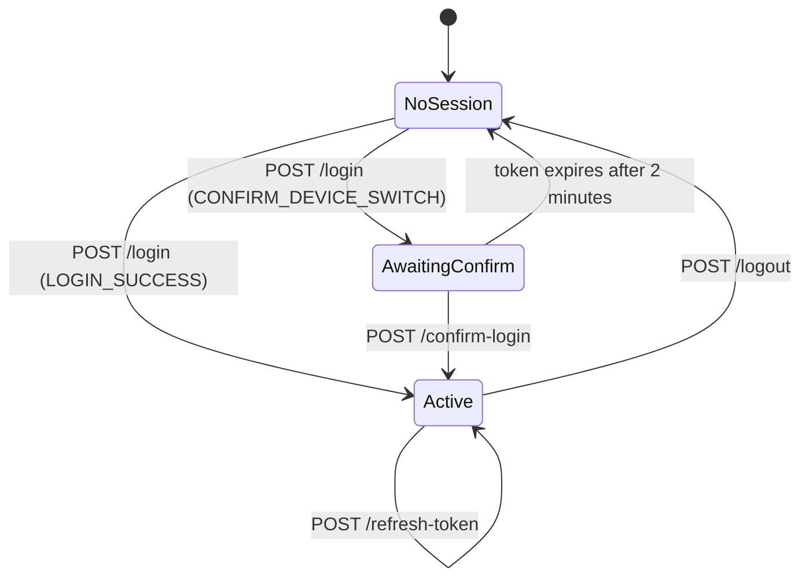

# Driver App

Endpoints under `/api/v1/driver` serve the Allow MENA driver mobile app. This section documents the
authentication surface — the four endpoints that get a driver a token and take it away again.

<Endpoint method="POST" path="/api/v1/driver/auth/..." auth="Bearer token (except login, confirm-login and refresh-token)" />

## Sessions, not just tokens

A driver's access token is only honoured while its **session row** is still active. Logging out
invalidates the session immediately, so a stolen access token stops working the moment the driver
logs out — it does not stay valid until `exp`.

One consequence shapes the whole flow: a driver can only be signed in on **one device at a time**.
Logging in on a second device does not silently displace the first; it returns a confirmation token
and asks the caller to confirm the switch.

## Endpoints

| Endpoint | Auth | Purpose |
| --- | --- | --- |
| [Login](/api/driver/login) <Method>POST</Method> | Email + password | Verify credentials; issue tokens, or ask to confirm a device switch. |
| [Confirm Login](/api/driver/confirm-login) <Method>POST</Method> | Confirmation token | Complete a device switch and issue tokens. |
| [Refresh Token](/api/driver/refresh-token) <Method>POST</Method> | Refresh token | Rotate both tokens and slide the session forward. |
| [Logout](/api/driver/logout) <Method>POST</Method> | Bearer access token | Invalidate the current session. |

## Token lifetimes

| Token | Default |
| --- | --- |
| Access token | 1 hour |
| Refresh token | 24 hours |
| Session | 24 hours, extended on each refresh |

Both tokens are HS256 JWTs and are signed with **different secrets**, so a refresh token cannot be
presented as an access token.
