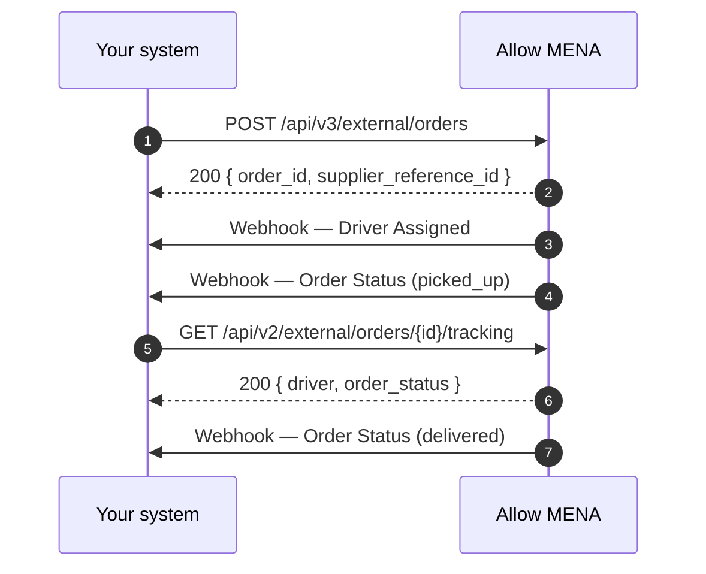

# Partner Orders

The partner API is the public integration surface. It is what a merchant, warehouse or
order-management system calls to hand deliveries to Allow MENA.

<Endpoint method="POST" path="/api/v{1,2,3}/external/..." auth="x-api-key header" />

## Your key identifies your branch

Every partner request is authenticated with `x-api-key`, and that key is bound server-side to one
supplier branch and one order source. Two consequences:

1. **No branch field in any request body.** The platform resolves the fulfilling branch from your key.
2. **You only ever see your own orders.** Track and status lookups filter by the branch behind the
   key, so requesting another branch's order id returns *not found*, not *forbidden*.

## Endpoints

| Endpoint | Version | Purpose |
| --- | --- | --- |
| [Create Order](/api/partner/create-order-v3) <Method>POST</Method> | v3 | Recommended. Batch create with scheduling, cart items and pickup instructions. |
| [Create Order](/api/partner/create-order-v2) <Method>POST</Method> | v2 | Previous generation. Same as v3 without attachment support. |
| [Create Order](/api/partner/create-order-v1) <Method>POST</Method> | v1 | Legacy. Drop-off and a pickup coordinate override only. |
| [Cancel Orders](/api/partner/cancel-orders) <Method>DELETE</Method> | v2 | Batch cancel with a per-order outcome. |
| [Track Order](/api/partner/track-order) <Method>GET</Method> | v2 | Live driver position, ETA and status. |
| [Get Order Status](/api/partner/order-status) <Method>GET</Method> | v1 | Status name only. Superseded by Track Order. |
| [Get Delivery Price](/api/partner/delivery-price) <Method>POST</Method> | v1 | Quote the delivery charge before committing to an order. |

Because cancel and track live only on `v2`, and the price quote and status lookup only on `v1`, a
production integration normally mixes versions. Order ids are global, so an order created on `v3`
cancels and tracks on `v2` without translation.

## A typical integration

Webhooks remove the need to poll. Configure them once per branch — see
[Webhooks](/api/webhooks/overview).

## Conventions on this surface

- **Request and response fields are `snake_case`**, with one exception: the drop-off and pickup
  objects are keyed `drop-off` and `pickup`, and `drop-off` uses a hyphen, not an underscore.
- **All create endpoints take a batch.** `orders` is always an array, even for one order.
- **Money is a decimal with up to 3 decimal places** — Kuwaiti dinar has three. Send `12.500`, not
  `12.5` rounded to cents.
- **Responses use the [simple envelope](/getting-started/response-format#partner-api-envelope)**:
  `{ status, message, data }`, with no `error_code` field on failures.
